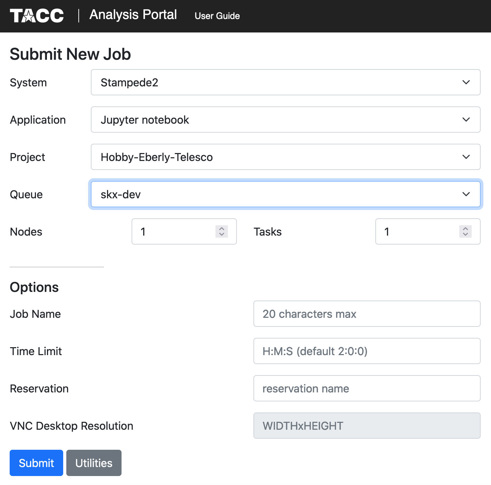

# LIGHETR Team HET Reduction Manual

## Step 1 - Get a TACC account
To execute reductions in near real-time for LIGHETR observations at the HET you will need a TACC account.  Email grzeimann@gmail.com for help.

## Step 2 - Open a terminal
```
ssh username@stampede2.tacc.utexas.edu
cd $HOME
ln -s $WORK work-stampede2
module load python3
pip3 install astropy --user
pip3 install seaborn --user
pip3 install specutils --user
pip3 install scikit-learn --user
pip3 install photutils=='0.7.2' --user
```
Once you have an account, you can go start visualization portal in a browser: https://vis.tacc.utexas.edu/jobs/

<p align="center">
  
</p>

Request a job as shown in the attached image (just click submit when you pull up the same left hand settings). After a small wait time, a new screen will show up and you will click connect.  Sometimes there are not enough nodes initially and you have to wait a bit longer. After you connect, you should be in your work directory, which will allow you to navigate to LRS2Multi/notebooks.  There will be a file called example_reduction.ipynb.  Open that notebook and follow the instructions to get started.
